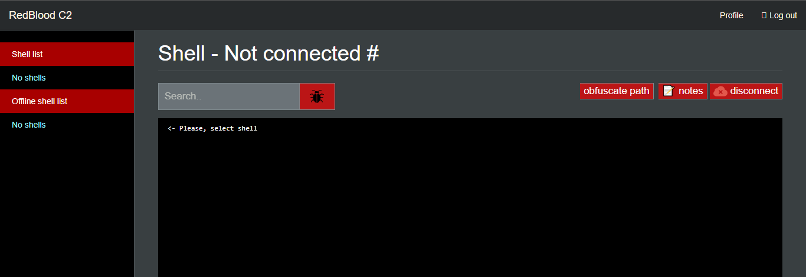
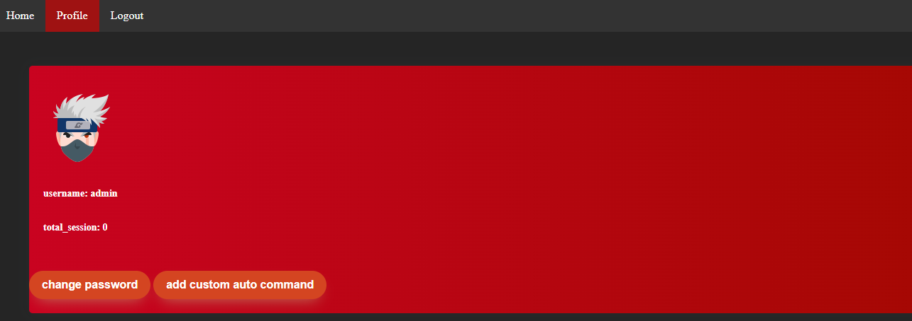

# Public version of Redblood C2 
```
This is a simple command and control server to handle sessions and your victims

```

## installation
```
1- download node.js 
2- install packages

```

## Usage
```
After install node.js and and all modules from npm 

execute:
node server.js 

Now visit http://localhost/

username: admin
password: admin

--------------------
# Features
```
|Feature |public|private|
|-----|--------|--------|
|FUD reverse shell (windows & linux) 🐞|❌       |✔️|
|admin panel 🛑|❌      |✔️|
|web UI  📱|✔️      |✔️|
|FUD powershell payload 🐞|❌      |✔️|
|FUD macro payload 🐞|❌      |✔️|
|FUD other types of malware 🐞|❌      |✔️|
|auto commands  🤖|✔️      |✔️|
|encrypt communication 🔐|❌      |✔️|
|block vpn and tor connections 🧅 |✔️      |✔️|
|manage users and sessions 📃|❌      |✔️|
|Sessions chart 📊 |❌      |✔️|
|FUD autoit shell |✔️      |✔️|

## notes:

Change the password of admin account and in .env file add your ipdata api key and change session vaible to something random 

and you can edit config.js to specify block type


------------------------------------------------------------------------------

# Screenshots


------------------------------------------------------------------------------




