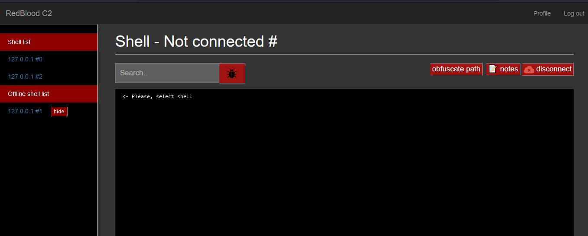

# Public version of Redblood C2 
```
This is a simple command and control server to handle sessions and your victims 

```

## installation
```
$ git clone https://github.com/kira2040k/RedbloodC2.git
$ cd RedbloodC2
$ npm install
$ node server.js
```

## Usage
```
After install node.js and and all modules from npm 

execute:
node server.js 

Now visit http://localhost/

username: admin
password: admin


```
-------------------------
|Feature |present
|-----|--------|
|FUD windows reverse shell  🐞|✔️|
|admin panel 🛑|✔️|
|web UI  📱|✔️|
|FUD powershell payload 🐞|✔️|
|FUD macro 🐞|✔️|
|FUD other types of malware 🐞|✔️|
|auto commands  🤖|✔️|
|encrypt communication 🔐|✔️|
|block vpn and tor connections 🧅 |✔️|    
|manage users and sessions 📃|✔️|     
|Sessions chart 📊 |❌|
|FUD autoit shell |✔️|
|on connections commands |✔️|    
|notes & obfuscate path |✔️|    
|http/s reverse shell |✔️| 

-------------------------

## New features: 
<ul>
<li>New UI</li>

<li>http / https payloads </li>
<li>FUD macro</li>
<li>nim & golang & C# & powershell payloads </li>
<li>FUD http/https powershell</li>
<li>manage sessions</li>
<li>admin and users </li>
<li>process list</li>
<li>upload & download files</li> 
<li>detect os</li>
<li>add modules keywords</li>
<ul>
<li>kiraRandomstr: for generate random string</li>
<li> kiraRandomint: generate random number</li>
</ul>
<li>add more modules</li>
<ul>
<li>browser modules</li>
<li> data exfiltration modules</li>
<li> windows persistence modules</li>
</ul>
<li>user can access limited sessions chosen by admin</li>
</ul>

## notes:

You can edit <a href="https://github.com/kira2040k/RedbloodC2/blob/main/config.js">config.js</a> to control over your C2.

Change the password of admin account and in .env file add your ipdata api key. 

change token in .env file
```
$ node 
> crypto.randomBytes(64).toString('hex');
dac771b25290f7a54ff628bdfc9a7e0de879d178a331b16cb65e7199b9d7ce2b7afb30f406415f3852704a0decba68a5c4859a81d29ee680e6427939fd8d99a2
``` 


------------------------------------------------------------------------------
<br>

##  <a href="/docs.pdf">Documentation</a>


<br>


------------------------------------------------------------------------------

# Screenshots


-------------------------------------------------------------------------------



------------------------------------------------------------------------------


